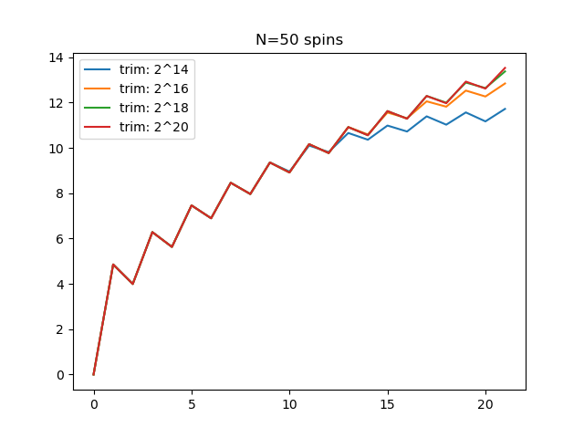

# Pauli-Strings
Basic matrix algebra using Pauli String represented as binary integers as in https://journals.aps.org/pra/abstract/10.1103/PhysRevA.68.042318

Defines an Operator type and operations on it.

Examples are in `examples.jl` and `lanczos_example.jl`.

## Initializing an operator

Import the library and initialize a operator of 3 qubits
```julia
include("pauli_strings.jl")
import .pauli_strings as ps
H = ps.Operator(3)
```

Add a Pauli strings to the operator
```julia
H += "XYZ"
H += "1YZ"
```

Add a Pauli string with a coeficient
```julia
H += (-1.2,"XXX") #coeficient can be complex
```

Add a 2-qubit string coupling qubits i and j with X and Y:
```julia
H += (2, 'X', i, 'Y', j) # with a coeficient=2
H += ('X', i, 'Y', j) # with a coeficient=1
```

Add a 1-qubit string:
```julia
H += (2, 'Z', i) # with a coeficient=2
H += ('Z', i) # with a coeficient=1
```

## Basic Algebra
The Operator type supports the +,-,* operators with other Operators and Numbers:
```julia
H3 = H1*H2
H3 = H1+H2
H3 = H1-H2
H3 = H1+2 # adding a scalar is equivalent to adding the unit times the scalar
H = 5*H # multiply operator by a scalar
```
Trace : `ps.trace(H)`

Frobenius norm : `ps.opnorm(H)`

Conjugate transpose : `ps.dagger(H)`

Number of terms: `length(H)`

Commutator: `ps.com(H1, H2)`. This is much faster than `H1*H2-H2*H1`


## Print and export
`print` shows a list of terms with coeficients e.g :
```julia
julia> println(H)
(10.0 - 0.0im) 1ZZ
(5.0 - 0.0im) 1Z1
(15.0 + 0.0im) XYZ
(5.0 + 0.0im) 1YY
```

Export a list of strings with coeficients:
```julia
coefs, strings = ps.op_to_strings(H)
```

## Truncate and Cutoff
`ps.truncate(H,M)` remove Pauli strings longer than M (returns a new Operator) 
`ps.cutoff(H,c)` remove Pauli strings with coeficient smaller than c in absolute value (returns a new Operator) 

## Lanczos
Import the Lanczos
```julia
include("pauli_strings.jl")
import .pauli_strings as ps
include("lanczos.jl")
import .pauli_lanczos as pl
```

Compute lanczos coeficients
```julia
bs = pl.lanczos(H, O, steps, maxlength, epsilon)
```
`H` : Hamiltonian

`O` : starting operator

`steps` : number of steps

`maxlength` : maximum string lenght for truncate at every step

`epsilion` : cutoff all terms smaller than epsilion

Results for X in XX from https://journals.aps.org/prx/pdf/10.1103/PhysRevX.9.041017 :


